# Cat Game Backend 현재 ERD

2026-09-11 기준 ORM 모델과 Alembic head를 반영한 22개 업무 테이블의 현재 구조다.

팀 기준 문서는 [Notion ERD - 현재 최종본](https://app.notion.com/p/ERD-03fdb49922e58311880781f373402039)이다.

## 최근 변경 사항

- 통합 보유 자산 테이블을 `user_cats`에서 `assets`로 변경했다.
- Python ORM 모델과 응답 DTO는 `Asset`, `AssetRead`를 사용한다.
- `CAT_MEMORIES.cat_asset_id`는 `ASSETS.id` 중 고양이 자산 행을 참조한다.
- `PLACED_OBJECTS.position_data`의 필수 좌표는 `x`, `y`, `z`다. 이전 `rotation` 값은 마이그레이션에서 `z`로 옮긴다.
- `TASKS`는 하나의 논리 문제에 직접 답안 채점 데이터와 선택적인 객관식 prompt·보기를 함께 저장한다.
- `TASK_PRESENTATIONS`는 난이도 확률로 고른 표시 방식과 섞은 보기 순서를 사용자 세션별로 고정한다.
- `USER_LEARNING_TIERS`는 Python과 SQL의 해금 난이도를 독립적으로 저장한다.
- `USERS.homepage_user_id`는 Django Auth Bridge가 반환한 홈페이지 사용자 ID를 `BIGINT UNIQUE`로 연결하며 API에는 노출하지 않는다.
- `TASK_ATTEMPTS.result_detail`은 외부에 공개 가능한 채점 결과만 저장하고 상태는 `PENDING`, `RUNNING`, `COMPLETED`, `FAILED` 흐름을 사용한다.
- 채점 워커는 `grading_started_at`과 `grading_lease_token`으로 시도를 임대한다. 만료된 `RUNNING` 임대는 회수할 수 있고 이전 워커의 늦은 결과는 토큰으로 거부한다.
- API에는 내부 INTEGER PK/FK를 노출하지 않고 UUID `public_id`와 `*_public_id`만 사용한다.
- 최초 학습 보상과 데일리 보상은 각각 `TASK_COMPLETIONS`, `DAILY_REWARD_CLAIMS` 원장으로 중복을 막는다.
- 브라우저 인증은 `AUTH_SESSIONS`의 폐기 가능한 토큰 해시와 `AUTH_RATE_LIMITS`의 HMAC 버킷을 사용한다.
- `USERS.state_version`은 권위 있는 게임 상태 변경과 같은 트랜잭션에서 증가해 늦게 도착한 응답을 구별한다.

## Mermaid ERD

```mermaid
erDiagram
    USERS {
        int id PK
        uuid public_id UK "UUIDv4"
        string email UK "lower(email) unique"
        bigint homepage_user_id UK "nullable, Django Auth Bridge user id"
        string username
        string role
        string password_hash "nullable"
        int balance
        int mileage
        int house_level
        int state_version "1 이상, 단조 증가"
        int wallpaper_item_id FK "nullable"
        int floor_item_id FK "nullable"
        int active_cat_id FK "nullable"
        jsonb game_settings
        datetime created_at
        datetime learning_reset_at "nullable"
    }

    ATTENDANCES {
        int id PK
        uuid public_id UK "UUIDv4"
        int user_id FK
        date check_in_date
        int streak_count
        datetime daily_reward_claimed_at "nullable"
    }

    ATTENDANCE_TASKS {
        int id PK
        uuid public_id UK "UUIDv4"
        int attendance_id FK
        int task_id FK
        int task_order
        boolean is_completed
    }

    CONCEPTS {
        int id PK
        uuid public_id UK "UUIDv4"
        string domain "PYTHON, SQL"
        string name "domain과 묶어 UK"
    }

    TASKS {
        int id PK
        uuid public_id UK "UUIDv4"
        int concept_id FK
        string title
        string type "CODE, MULTIPLE_CHOICE"
        string difficulty "BRONZE, SILVER, GOLD"
        text description
        text template_code
        text test_cases "채점용 테스트 데이터"
        text multiple_choice_prompt "nullable"
        jsonb options "객관식 보기, nullable"
        string correct_option "객관식 정답, nullable"
        text hint_text "nullable"
        boolean is_active
    }

    TASK_PRESENTATIONS {
        int id PK
        uuid public_id UK "UUIDv4"
        int user_id FK
        int task_id FK
        string context_type
        string presentation_type "CODE, MULTIPLE_CHOICE"
        text description
        jsonb options "섞인 보기, nullable"
        string correct_option "섞인 정답 위치, nullable"
        string status "ACTIVE, COMPLETED"
        datetime created_at
    }

    USER_PROFICIENCY {
        int id PK
        uuid public_id UK "UUIDv4"
        int user_id FK
        int concept_id FK
        int proficiency_level
    }

    USER_LEARNING_TIERS {
        int id PK
        uuid public_id UK "UUIDv4"
        int user_id FK
        string domain "PYTHON, SQL"
        string current_tier "BRONZE, SILVER, GOLD"
        datetime silver_unlocked_at "nullable"
        datetime gold_unlocked_at "nullable"
        datetime updated_at
    }

    TASK_ATTEMPTS {
        int id PK
        uuid public_id UK "UUIDv4"
        int user_id FK
        int task_id FK
        int presentation_id FK "nullable"
        int attendance_task_id FK "nullable"
        int room_task_id FK "nullable"
        string context_type
        text submitted_code
        string status "PENDING, RUNNING, COMPLETED, FAILED"
        boolean is_correct "nullable"
        boolean used_hint
        datetime attempted_at
        datetime grading_started_at "nullable"
        uuid grading_lease_token "nullable"
        text result_detail "공개 가능한 채점 결과, nullable"
    }

    ROOMS {
        int id PK
        uuid public_id UK "UUIDv4"
        int host_user_id FK
        string title
        string status
        int max_participants
    }

    ROOM_PARTICIPANTS {
        int id PK
        uuid public_id UK "UUIDv4"
        int room_id FK
        int user_id FK
        string team_name "nullable"
        int current_score
        boolean is_ready
    }

    ROOM_TASKS {
        int id PK
        uuid public_id UK "UUIDv4"
        int room_id FK
        int task_id FK
        int task_order
    }

    ITEMS {
        int id PK
        uuid public_id UK "UUIDv4"
        string category
        string name
        int price
    }

    PLACED_OBJECTS {
        int id PK
        uuid public_id UK "UUIDv4"
        int user_id FK
        int item_id FK
        jsonb position_data "x, y, z"
    }

    CATS {
        int id PK
        uuid public_id UK "UUIDv4"
        string name
        string persona
        string rarity
    }

    ASSETS {
        int id PK
        uuid public_id UK "UUIDv4"
        int user_id FK
        int cat_id FK "nullable"
        int item_id FK "nullable"
        int quantity
    }

    GACHA_EXECUTIONS {
        int id PK
        uuid public_id UK "UUIDv4"
        int user_id FK
        uuid request_id UK
        jsonb request_payload
        string request_hash "SHA-256"
        string operation_type
        string status "ACQUIRED, COMPLETED, HASH_CONFLICT"
        int draw_count "nullable"
        int balance_cost "default 0"
        jsonb result_data "nullable"
        datetime created_at
        datetime completed_at "nullable"
    }

    CAT_MEMORIES {
        int id PK
        uuid public_id UK "UUIDv4"
        int cat_asset_id FK "references assets.id"
        text context_summary
        datetime created_at
    }

    TASK_COMPLETIONS {
        int id PK
        uuid public_id UK "UUIDv4"
        int user_id FK
        int task_id FK
        int first_attempt_id FK
        int coins_awarded
        datetime completed_at
    }

    DAILY_REWARD_CLAIMS {
        int id PK
        uuid public_id UK "UUIDv4"
        int user_id FK
        date claim_date
        string reward_key
        int coins_awarded
        datetime claimed_at
    }

    AUTH_SESSIONS {
        int id PK
        uuid public_id UK "UUIDv4"
        int user_id FK
        string token_hash UK "SHA-256"
        string csrf_token_hash "SHA-256"
        datetime expires_at
        datetime revoked_at "nullable"
    }

    AUTH_RATE_LIMITS {
        int id PK
        uuid public_id UK "UUIDv4"
        string bucket_hash UK "HMAC-SHA-256"
        int attempts
        datetime window_started_at
        datetime blocked_until "nullable"
        datetime updated_at
    }

    USERS ||--o{ ATTENDANCES : checks_in
    ATTENDANCES ||--o{ ATTENDANCE_TASKS : assigns
    TASKS ||--o{ ATTENDANCE_TASKS : scheduled_as

    USERS ||--o{ USER_PROFICIENCY : has
    USERS ||--o{ USER_LEARNING_TIERS : unlocks
    CONCEPTS ||--o{ USER_PROFICIENCY : measured_by
    CONCEPTS ||--o{ TASKS : categorizes

    USERS ||--o{ TASK_ATTEMPTS : submits
    TASKS ||--o{ TASK_ATTEMPTS : attempted_as
    USERS ||--o{ TASK_PRESENTATIONS : receives
    TASKS ||--o{ TASK_PRESENTATIONS : presented_as
    TASK_PRESENTATIONS o|--o{ TASK_ATTEMPTS : grades_with
    USERS ||--o{ TASK_COMPLETIONS : earns
    TASKS ||--o{ TASK_COMPLETIONS : completed_once
    TASK_ATTEMPTS ||--o| TASK_COMPLETIONS : first_reward
    ATTENDANCE_TASKS o|--o{ TASK_ATTEMPTS : daily_context
    ROOM_TASKS o|--o{ TASK_ATTEMPTS : battle_context

    USERS ||--o{ ROOMS : hosts
    ROOMS ||--o{ ROOM_PARTICIPANTS : contains
    USERS ||--o{ ROOM_PARTICIPANTS : joins
    ROOMS ||--o{ ROOM_TASKS : assigns
    TASKS ||--o{ ROOM_TASKS : assigned_to

    USERS ||--o{ ASSETS : owns
    CATS o|--o{ ASSETS : held_as
    ITEMS o|--o{ ASSETS : held_as

    USERS ||--o{ PLACED_OBJECTS : places
    ITEMS ||--o{ PLACED_OBJECTS : placed_as
    ITEMS o|--o{ USERS : selected_wallpaper
    ITEMS o|--o{ USERS : selected_floor

    USERS ||--o{ GACHA_EXECUTIONS : executes
    USERS ||--o{ DAILY_REWARD_CLAIMS : claims
    USERS ||--o{ AUTH_SESSIONS : authenticates
    ASSETS ||--o{ CAT_MEMORIES : remembers
```

## 주요 제약

- `ASSETS`는 `cat_id`와 `item_id` 중 정확히 하나만 가진다.
- 고양이 자산은 `quantity = 1`이며 중복 획득은 마일리지로 전환한다.
- `CAT_MEMORIES.cat_asset_id`는 `ASSETS` 중 `cat_id`가 있는 행만 참조할 수 있다.
- 가구 배치 수는 사용자가 보유한 해당 아이템의 `ASSETS.quantity`를 초과할 수 없다.
- `GACHA_EXECUTIONS.request_id`는 전역 UNIQUE이고 다른 사용자나 다른 요청 내용의 재사용은 충돌이다.
- `USERS.homepage_user_id`는 nullable UNIQUE이며 동일한 홈페이지 사용자를 둘 이상의 게임 사용자 행에 연결할 수 없다.
- `TASKS.type = CODE`는 연결된 `CONCEPTS.domain`에 따라 Python 또는 격리된 PostgreSQL 채점기로 분기한다.
- `TASKS.options`가 있는 논리 문제는 직접 작성과 객관식 표현을 모두 지원한다. GOLD seed는 객관식 데이터를 만들지 않는다.
- 활성 `TASK_PRESENTATIONS`는 사용자·논리 문제·문맥별 하나이며 정답 처리 전까지 유형과 보기 순서를 유지한다.
- `TASK_COMPLETIONS`의 유일 키는 계속 `(user_id, task_id)`이므로 표시 방식별로 완료나 보상을 중복 집계하지 않는다.
- `TASK_ATTEMPTS.result_detail`에는 verdict와 공개 가능한 오류 요약만 저장한다.
