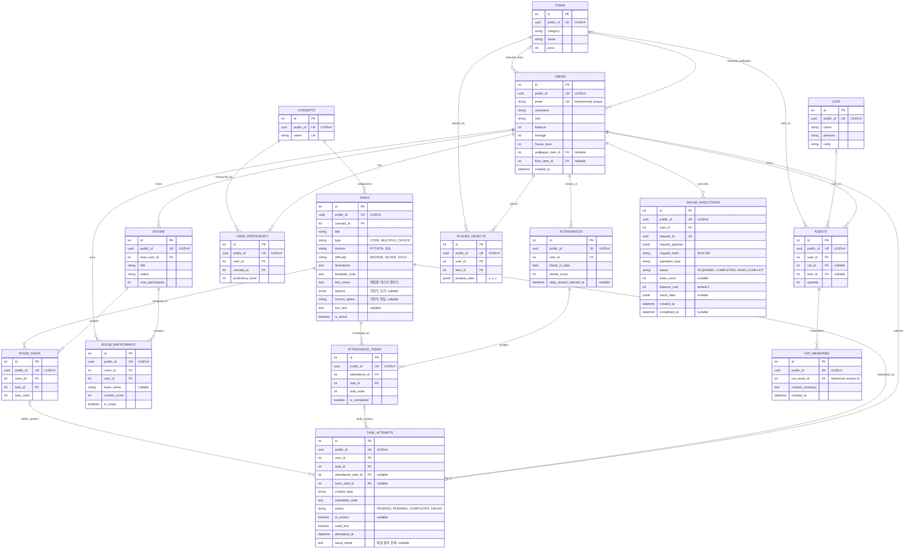

# Cat Game Backend 현재 ERD

2026-09-04 기준 ORM 모델과 Alembic head를 반영한 16개 업무 테이블의 현재 구조다.

팀 기준 문서는 [Notion ERD 추가수정버전](https://app.notion.com/p/3d1db49922e580e79ba1e7d318230025)이다.

## 최근 변경 사항

- 통합 보유 자산 테이블을 `user_cats`에서 `assets`로 변경했다.
- Python ORM 모델과 응답 DTO는 `Asset`, `AssetRead`를 사용한다.
- `CAT_MEMORIES.cat_asset_id`는 `ASSETS.id` 중 고양이 자산 행을 참조한다.
- `PLACED_OBJECTS.position_data`의 필수 좌표는 `x`, `y`, `z`다. 이전 `rotation` 값은 마이그레이션에서 `z`로 옮긴다.
- `TASKS`는 `CODE`와 `MULTIPLE_CHOICE`, `PYTHON`과 `SQL`을 함께 지원하며 객관식 메타데이터를 JSONB로 저장한다.
- `TASK_ATTEMPTS.result_detail`은 채점 결과 상세를 저장하고 상태는 `PENDING`, `RUNNING`, `COMPLETED`, `FAILED` 흐름을 사용한다.
- API에는 내부 INTEGER PK/FK를 노출하지 않고 UUID `public_id`와 `*_public_id`만 사용한다.

## Mermaid ERD

## 주요 제약

- `ASSETS`는 `cat_id`와 `item_id` 중 정확히 하나만 가진다.
- 고양이 자산은 `quantity = 1`이며 중복 획득은 마일리지로 전환한다.
- `CAT_MEMORIES.cat_asset_id`는 `ASSETS` 중 `cat_id`가 있는 행만 참조할 수 있다.
- 가구 배치 수는 사용자가 보유한 해당 아이템의 `ASSETS.quantity`를 초과할 수 없다.
- `GACHA_EXECUTIONS.request_id`는 전역 UNIQUE이고 다른 사용자나 다른 요청 내용의 재사용은 충돌이다.
- `TASKS.type = CODE`는 `domain`에 따라 Python 또는 격리된 PostgreSQL 채점기로 분기한다.
- `TASKS.type = MULTIPLE_CHOICE`는 `options`와 `correct_option`을 사용하며 채점 전용 값은 API에 노출하지 않는다.
- `TASK_ATTEMPTS.result_detail`에는 verdict와 공개 가능한 오류 요약만 저장한다.
